# 同济大学计算机科学与技术学院2025计算机组成原理单周期31条指令cpu
### **基本信息**  
- **学院**：计算机科学与技术学院  
- **专业**：计算机科学与技术  
- **学生姓名**：程浩然  
- **指导教师**：张冬冬  
- **日期**：**2025年05月25日** 
---
## 文档组成
 - document 相关设计文档
   - 31条指令操作时间表.xlsx
   - tongji-undergard-thesis 同济大学本科生毕业论文模板
     - main.pdf 实验报告
     - main.tex latex 文档
 - project1 cpu设计与实现
   - project_1\project_1.srcs\sources_1\new 为设计文件目录
 - submission 可通过线上评测文件目录 submission.zip 是该文件夹的压缩包
 - test_data 测试数据目录，可以在vivado工程当中使用$readmemb 命令读取到imem当中测试
 - report.txt 时序逻辑测试报告

## alu 信号集
| alu操作表 |       |
|--------|-------|
| add    | 0010  |
| addu   | 0000  |
| sub    | 0011  |
| subu   | 0001  |
| and    | 0100  |
| or     | 0101  |
| xor    | 0110  |
| nor    | 0111  |
| slt    | 1011  |
| sltu   | 1010  |
| sll    | 1110  |
| srl    | 1101  |
| sra    | 1100  |
| lui    | 1000  |

---
## 指令与操作时间表
| cpu指令集 | op     | func   | PC_CLK | M1 | IM_R | RF_W | RF_CLK | S/!U | M2 | M4 | CS | DM_W | DM_R | CLK | ALUCTR | Btype | M5 | M3 | M6 |
|-----------|--------|--------|--------|----|------|------|--------|------|----|----|----|------|------|-----|--------|-------|----|----|----|
| add       | 000000 | 100000 | 1      | 00 | 1    | 1    | 1      | 0    | 00 | 0  | 0  | 0    | 0    | 1   | 0010   | 0     | 00 | 00 | 0  |
| addu      | 000000 | 100001 | 1      | 00 | 1    | 1    | 1      | 0    | 00 | 0  | 0  | 0    | 0    | 1   | 0000   | 0     | 00 | 00 | 0  |
| sub       | 000000 | 100010 | 1      | 00 | 1    | 1    | 1      | 0    | 00 | 0  | 0  | 0    | 0    | 1   | 0011   | 0     | 00 | 00 | 0  |
| subu      | 000000 | 100011 | 1      | 00 | 1    | 1    | 1      | 0    | 00 | 0  | 0  | 0    | 0    | 1   | 0001   | 0     | 00 | 00 | 0  |
| and       | 000000 | 100100 | 1      | 00 | 1    | 1    | 1      | 0    | 00 | 0  | 0  | 0    | 0    | 1   | 0100   | 0     | 00 | 00 | 0  |
| or        | 000000 | 100101 | 1      | 00 | 1    | 1    | 1      | 0    | 00 | 0  | 0  | 0    | 0    | 1   | 0101   | 0     | 00 | 00 | 0  |
| xor       | 000000 | 100110 | 1      | 00 | 1    | 1    | 1      | 0    | 00 | 0  | 0  | 0    | 0    | 1   | 0110   | 0     | 00 | 00 | 0  |
| nor       | 000000 | 100111 | 1      | 00 | 1    | 1    | 1      | 0    | 00 | 0  | 0  | 0    | 0    | 1   | 0111   | 0     | 00 | 00 | 0  |
| slt       | 000000 | 101010 | 1      | 00 | 1    | 1    | 1      | 0    | 00 | 0  | 0  | 0    | 0    | 1   | 1011   | 0     | 00 | 00 | 0  |
| sltu      | 000000 | 101011 | 1      | 00 | 1    | 1    | 1      | 0    | 00 | 0  | 0  | 0    | 0    | 1   | 1010   | 0     | 00 | 00 | 0  |
| sll       | 000000 | 000000 | 1      | 00 | 1    | 1    | 1      | 0    | 00 | 0  | 0  | 0    | 0    | 1   | 1110   | 0     | 01 | 00 | 0  |
| srl       | 000000 | 000010 | 1      | 00 | 1    | 1    | 1      | 0    | 00 | 0  | 0  | 0    | 0    | 1   | 1101   | 0     | 01 | 00 | 0  |
| sra       | 000000 | 000011 | 1      | 00 | 1    | 1    | 1      | 0    | 00 | 0  | 0  | 0    | 0    | 1   | 1100   | 0     | 01 | 00 | 0  |
| sllv      | 000000 | 000100 | 1      | 00 | 1    | 1    | 1      | 0    | 00 | 0  | 0  | 0    | 0    | 1   | 1110   | 0     | 00 | 00 | 0  |
| srlv      | 000000 | 000110 | 1      | 00 | 1    | 1    | 1      | 0    | 00 | 0  | 0  | 0    | 0    | 1   | 1101   | 0     | 00 | 00 | 0  |
| srav      | 000000 | 000111 | 1      | 00 | 1    | 1    | 1      | 0    | 00 | 0  | 0  | 0    | 0    | 1   | 1100   | 0     | 00 | 00 | 0  |
| jr        | 000000 | 001000 | 1      | 10 | 1    | 0    | 1      | 0    | 00 | 0  | 0  | 0    | 0    | 1   | 0000   | 0     | 00 | 00 | 0  |
| addi      | 001000 | 000000 | 1      | 00 | 1    | 1    | 1      | 1    | 00 | 1  | 0  | 0    | 0    | 1   | 0010   | 0     | 00 | 10 | 0  |
| addiu     | 001001 | 000000 | 1      | 00 | 1    | 1    | 1      | 1    | 00 | 1  | 0  | 0    | 0    | 1   | 0000   | 0     | 00 | 10 | 0  |
| andi      | 001100 | 000000 | 1      | 00 | 1    | 1    | 1      | 0    | 00 | 1  | 0  | 0    | 0    | 1   | 0100   | 0     | 00 | 10 | 0  |
| ori       | 001101 | 000000 | 1      | 00 | 1    | 1    | 1      | 0    | 00 | 1  | 0  | 0    | 0    | 1   | 0101   | 0     | 00 | 10 | 0  |
| xori      | 001110 | 000000 | 1      | 00 | 1    | 1    | 1      | 0    | 00 | 1  | 0  | 0    | 0    | 1   | 0110   | 0     | 00 | 10 | 0  |
| lw        | 100011 | 000000 | 1      | 00 | 1    | 1    | 1      | 1    | 01 | 1  | 1  | 0    | 1    | 1   | 0010   | 0     | 00 | 10 | 0  |
| sw        | 101011 | 000000 | 1      | 00 | 1    | 0    | 1      | 1    | 00 | 1  | 1  | 1    | 0    | 1   | 0010   | 0     | 00 | 10 | 0  |
| beq       | 000100 | 000000 | 1      | 00 | 1    | 0    | 1      | 1    | 00 | 1  | 0  | 0    | 0    | 1   | 0011   | 1     | 11 | 00 | 1  |
| bne       | 000101 | 000000 | 1      | 00 | 1    | 0    | 1      | 1    | 00 | 1  | 0  | 0    | 0    | 1   | 0011   | 1     | 11 | 00 | 0  |
| slti      | 001010 | 000000 | 1      | 00 | 1    | 1    | 1      | 1    | 00 | 0  | 0  | 0    | 0    | 1   | 1011   | 0     | 00 | 10 | 0  |
| sltiu     | 001011 | 000000 | 1      | 00 | 1    | 1    | 1      | 0    | 00 | 0  | 0  | 0    | 0    | 1   | 1010   | 0     | 00 | 10 | 0  |
| lui       | 001111 | 000000 | 1      | 00 | 1    | 1    | 1      | 0    | 00 | 1  | 0  | 0    | 0    | 1   | 1000   | 0     | 10 | 10 | 0  |
| j         | 000010 | 000000 | 1      | 01 | 1    | 0    | 1      | 0    | 00 | 0  | 0  | 0    | 0    | 1   | 0000   | 0     | 00 | 00 | 0  |
| jal       | 000011 | 000000 | 1      | 01 | 1    | 1    | 1      | 0    | 10 | 0  | 0  | 0    | 0    | 1   | 0000   | 0     | 00 | 01 | 0  |
---
## 指令操作逻辑
| 助记符 | 指令格式 |         |        |           |       |        | 示例            | 示例含义                         | 操作及其解释                                                                        |
|--------|----------|---------|--------|-----------|-------|--------|-----------------|----------------------------------|-------------------------------------------------------------------------------------|
| Bit #  | 31..26   | 25..21  | 20..16 | 15..11    | 10..6 | 5..0   |                 |                                  |                                                                                     |
| R-type | op       | rs      | rt     | rd        | shamt | func   |                 |                                  |                                                                                     |
| add    | 000000   | rs      | rt     | rd        | 0     | 100000 |  add $1,$2,$3   |  $1=$2+$3                        |  rd <- rs + rt   ；其中rs＝$2，rt=$3, rd=$1                                         |
| addu   | 000000   | rs      | rt     | rd        | 0     | 100001 |  addu $1,$2,$3  |  $1=$2+$3                        |  rd <- rs + rt   ；其中rs＝$2，rt=$3,   rd=$1,无符号数                              |
| sub    | 000000   | rs      | rt     | rd        | 0     | 100010 |  sub $1,$2,$3   |  $1=$2-$3                        |  rd <- rs - rt   ；其中rs＝$2，rt=$3, rd=$1                                         |
| subu   | 000000   | rs      | rt     | rd        | 0     | 100011 |  subu $1,$2,$3  |  $1=$2-$3                        |  rd <- rs - rt   ；其中rs＝$2，rt=$3,   rd=$1,无符号数                              |
| and    | 000000   | rs      | rt     | rd        | 0     | 100100 |  and $1,$2,$3   |  $1=$2 & $3                      |  rd <- rs & rt   ；其中rs＝$2，rt=$3,   rd=$1                                       |
| or     | 000000   | rs      | rt     | rd        | 0     | 100101 |  or $1,$2,$3    |  $1=$2 \| $3                     |  rd <- rs \| rt   ；其中rs＝$2，rt=$3, rd=$1                                        |
| xor    | 000000   | rs      | rt     | rd        | 0     | 100110 |  xor $1,$2,$3   |  $1=$2 ^ $3                      |  rd <- rs xor rt   ；其中rs＝$2，rt=$3,   rd=$1(异或）                              |
| nor    | 000000   | rs      | rt     | rd        | 0     | 100111 |  nor $1,$2,$3   |  $1=~($2 \| $3)                  |  rd <- not(rs \| rt)   ；其中rs＝$2，rt=$3,   rd=$1(或非）                          |
| slt    | 000000   | rs      | rt     | rd        | 0     | 101010 |  slt $1,$2,$3   |  if($2<$3)   $1=1 else      $1=0 |  if (rs < rt) rd=1 else rd=0 ；其中rs＝$2，rt=$3,   rd=$1                           |
| sltu   | 000000   | rs      | rt     | rd        | 0     | 101011 |  sltu $1,$2,$3  |  if($2<$3)   $1=1 else      $1=0 |  if (rs < rt) rd=1 else rd=0 ；其中rs＝$2，rt=$3,   rd=$1  (无符号数）              |
| sll    | 000000   | 0       | rt     | rd        | shamt | 000000 |  sll $1,$2,10   |  $1=$2<<10                       |  rd <- rt <<   shamt  ；shamt存放移位的位数，也就是指令中的立即数，其中rt=$2, rd=$1 |
| srl    | 000000   | 0       | rt     | rd        | shamt | 000010 |  srl $1,$2,10   |  $1=$2>>10                       |  rd <- rt >> shamt ；(logical) ，其中rt=$2, rd=$1                                   |
| sra    | 000000   | 0       | rt     | rd        | shamt | 000011 |  sra $1,$2,10   |  $1=$2>>10                       |  rd <- rt >> shamt    ；(arithmetic) 注意符号位保留， 其中rt=$2, rd=$1              |
| sllv   | 000000   | rs      | rt     | rd        | 0     | 000100 |  sllv $1,$2,$3  |  $1=$2<<$3                       |  rd <- rt << rs  ；其中rs＝$3，rt=$2,   rd=$1                                       |
| srlv   | 000000   | rs      | rt     | rd        | 0     | 000110 |  srlv $1,$2,$3  |  $1=$2>>$3                       |  rd <- rt >>   rs  ；(logical)其中rs＝$3，rt=$2, rd=$1                              |
| srav   | 000000   | rs      | rt     | rd        | 0     | 000111 |  srav $1,$2,$3  |  $1=$2>>$3                       |  rd <- rt >>   rs  ；(arithmetic) 注意符号位保留 其中rs＝$3，rt=$2, rd=$1           |
| jr     | 000000   | rs      | 0      | 0         | 0     | 001000 |  jr $31         |  goto $31                        |  PC <- rs                                                                           |
| I-type | op       | rs      | rt     | immediate |       |        |                 |                                  |                                                                                     |
| addi   | 001000   | rs      | rt     | immediate |       |        |  addi $1,$2,100 |  $1=$2+100                       |  rt <- rs + (sign-extend)immediate ；其中rt=$1,rs=$2                                |
| addiu  | 001001   | rs      | rt     | immediate |       |        | addiu $1,$2,100 |  $1=$2+100                       |  rt <- rs + (zero-extend)immediate ；其中rt=$1,rs=$2                                |
| andi   | 001100   | rs      | rt     | immediate |       |        |  andi $1,$2,10  |  $1=$2 & 10                      |  rt <- rs &   (zero-extend)immediate ；其中rt=$1,rs=$2                              |
| ori    | 001101   | rs      | rt     | immediate |       |        |  andi $1,$2,10  |  $1=$2 \| 10                     |  rt <- rs \| (zero-extend)immediate ；其中rt=$1,rs=$2                               |
| xori   | 001110   | rs      | rt     | immediate |       |        |  andi $1,$2,10  |  $1=$2 ^ 10                      |  rt <- rs xor   (zero-extend)immediate ；其中rt=$1,rs=$2                            |
| lui    | 001111   | 0       | rt     | immediate |       |        |  lui $1,100     |  $1=100*65536                    |  rt <-   immediate*65536 ；将16位立即数放到目标寄存器高16位，目标寄存器的低16位填0  |
| lw     | 100011   | rs      | rt     | immediate |       |        |  lw $1,10($2)   |  $1=memory[$2+10]                |  rt <- memory[rs +   (sign-extend)immediate] ；rt=$1,rs=$2                          |
| sw     | 101011   | rs      | rt     | immediate |       |        |  sw $1,10($2)   |  memory[$2+10]=$1                |  memory[rs + (sign-extend)immediate] <-   rt ；rt=$1,rs=$2                          |
| beq    | 000100   | rs      | rt     | immediate |       |        |  beq $1,$2,10   |  if($1==$2)  goto PC+4+40        |  if (rs == rt) PC <- PC+4 +   (sign-extend)immediate<<2                             |
| bne    | 000101   | rs      | rt     | immediate |       |        |  bne $1,$2,10   |  if($1!=$2) goto PC+4+40         |  if (rs != rt) PC <- PC+4 +   (sign-extend)immediate<<2                             |
| slti   | 001010   | rs      | rt     | immediate |       |        |  slti $1,$2,10  |  if($2<10) $1=1 else   $1=0      |  if (rs <(sign-extend)immediate)   rt=1 else rt=0 ；   其中rs＝$2，rt=$1            |
| sltiu  | 001011   | rs      | rt     | immediate |       |        |  sltiu $1,$2,10 |  if($2<10)   $1=1 else   $1=0    |  if (rs <(zero-extend)immediate)   rt=1 else rt=0 ；  其中rs＝$2，rt=$1             |
| J-type | op       | address |        |           |       |        |                 |                                  |                                                                                     |
| j      | 000010   | address |        |           |       |        |  j 10000        |  goto 10000                      |  PC <-   (PC+4)[31..28],address,0,0   ；address=10000/4                             |
| jal    | 000011   | address |        |           |       |        |  jal 10000      |  $31<-PC+4; goto 10000           |  $31<-PC+4；PC <-   (PC+4)[31..28],address,0,0   ；address=10000/4                  |

## 每条指令的数据通路图
特别说明，为了减少工作量，提高文档阅读效率，考虑将数据通路相同的指令合并展示。

### add数据通路
在本节，与add数据通路相同的指令包括：add、addu、sub、subu、and、or、xor、nor、slt、sltu、sllv、srlv、srav。  
数据通路如下：  
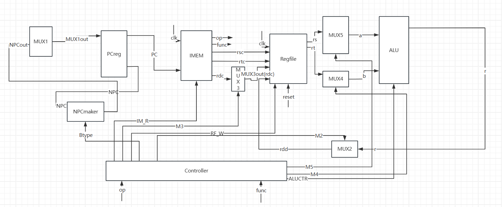  
**图1 add数据通路**  

在运行add的过程中，会执行如下动作：  
**时钟的上升沿**：  
- PC->IMEM  
- op->controller  
- func->controller  
- rsc->regfile  
- rtc->regfile  
- rdc->regfile  
- rs->alu  
- rt->alu  
- alu根据输入信号决定执行的指令  
- r->rdd 更新rd的数据  

**时钟的下降沿**：npc-> PCreg  

### sll数据通路
在本节当中，与sll数据通路相同的指令包括：srl、sra。  
数据通路如下：  
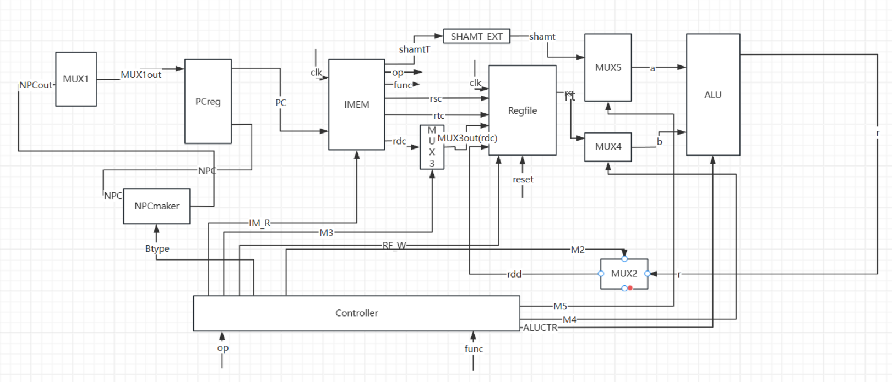  
**图2 sll数据通路**  

在运行sll的过程中，会执行如下动作：  
**时钟的上升沿**：  
- PC->IMEM  
- op->controller  
- func->controller  
- rsc->regfile  
- rdc->regfile  
- shamtT->SHAMT_EXT  
- shamt->alu  
- rs->alu  
- alu根据输入信号决定执行的指令  
- r->rdd 更新rd的数据  

**时钟的下降沿**：npc-> PCreg  

### jr数据通路
在本节中，jr拥有特别的数据通路。  
数据通路如下：  
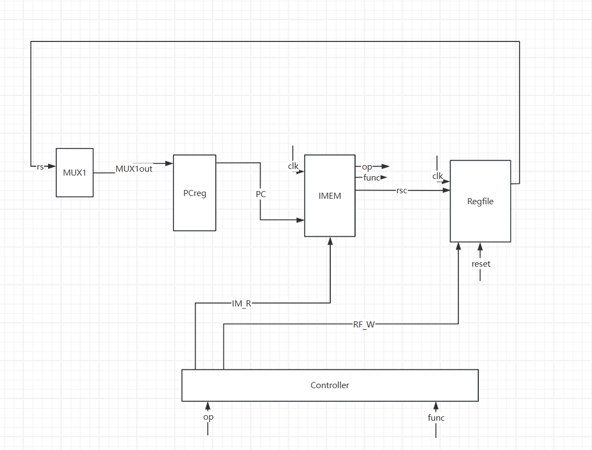  
**图3 jr数据通路**  

在执行jr指令的过程中，会执行如下操作：  
**时钟的上升沿**：  
- PC->IMEM  
- op->controller  
- func->controller  
- rsc->regfile  

**时钟的下降沿**：rs->PCreg  

### addi数据通路
在本节，与add数据通路相同的指令包括：addi、addiu、ori、xori。  
需要特别说明的是，在MIPS指令架构下，addiu作的是有符号拓展。  
数据通路如下：  
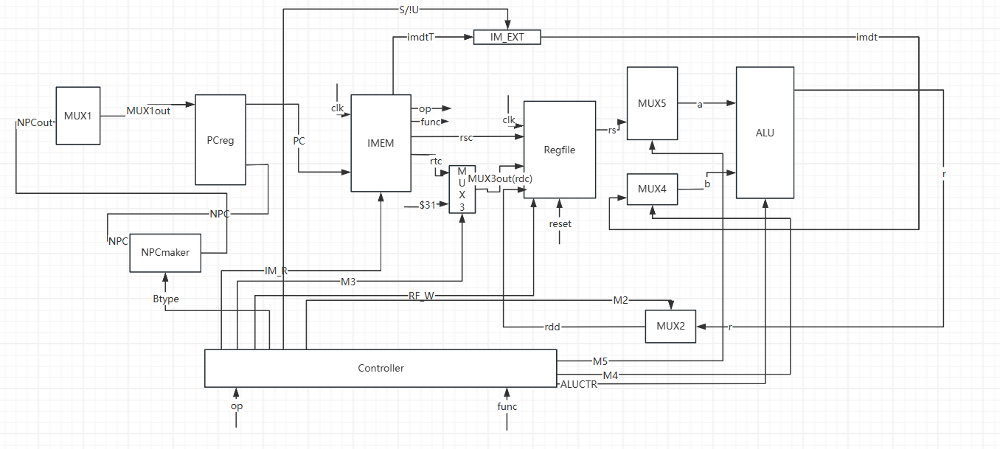  
**图4 addi数据通路**  

在运行addi的过程中，会执行如下动作：  
**时钟的上升沿**：  
- PC->IMEM  
- op->controller  
- func->controller  
- rsc->regfile  
- rtc->regfile  
- rs->alu  
- imdtT->imdt_EXT  
- imdt->alu  
- alu根据输入信号决定执行的指令  
- r->rt 更新rt的数据  

**时钟的下降沿**：npc-> PCreg  

### lw数据通路
lw拥有独特的数据通路。  
数据通路如下：  
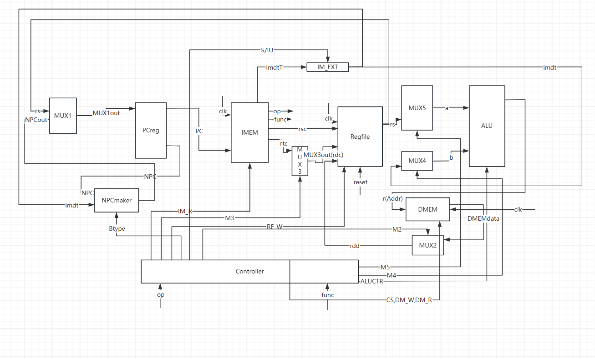  
**图5 lw数据通路**  

在运行lw的过程中，会执行如下动作：  
**时钟的上升沿**：  
- PC->IMEM  
- op->controller  
- func->controller  
- rsc->regfile  
- rtc->regfile  
- rs->alu  
- imdtT->imdt_EXT  
- imdt->rs  
- alu执行有符号加法  
- alu->DMEMaddr  
- DMEMdata->rt  

**时钟的下降沿**：npc-> PCreg  

### sw数据通路
sw拥有独特的数据通路。  
数据通路如下：  
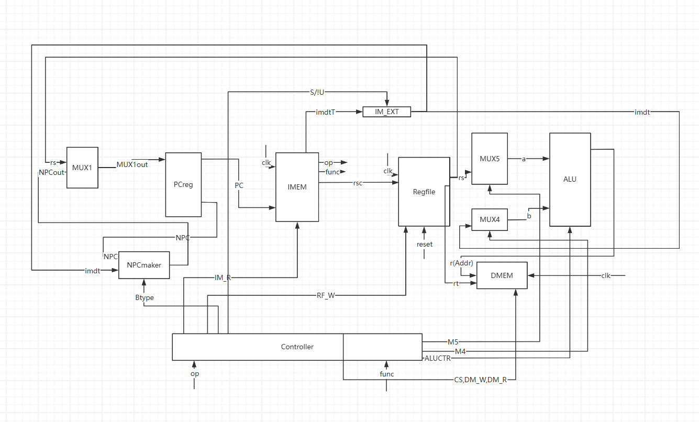  
**图6 sw数据通路**  

在运行sw的过程中，会执行如下动作：  
**时钟的上升沿**：  
- PC->IMEM  
- op->controller  
- func->controller  
- rsc->regfile  
- rtc->regfile  
- rs->alu  
- imdtT->imdt_EXT  
- imdt->rs  
- alu执行有符号加法  
- alu->DMEMaddr  
- rt->DMEMdata  

**时钟的下降沿**：npc-> PCreg  

### beq数据通路
beq拥有独特的数据通路。  
数据通路如下：  
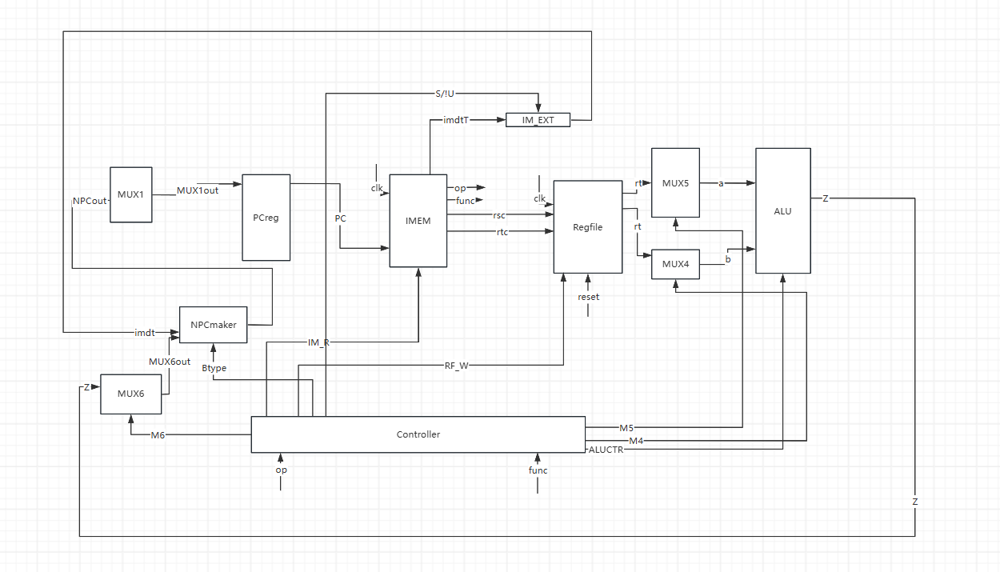  
**图7 beq数据通路**  

在运行beq的过程中，会执行如下动作：  
**时钟的上升沿**：  
- PC->IMEM  
- op->controller  
- func->controller  
- rsc->regfile  
- rtc->regfile  
- rs->alu  
- imdtT->imdt_EXT  
- imdt->rs  
- alu执行无符号减法  
- z->npcmaker  
- 根据z信号，npc与imdt作有符号加法  

**时钟的下降沿**：NPCout-> PCreg  

### bne数据通路
bne拥有独特的数据通路。  
数据通路如下：  
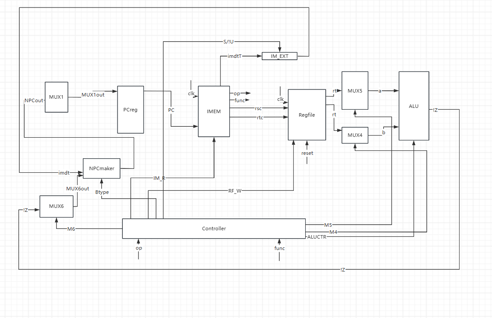  
**图8 bne数据通路**  

在运行bne的过程中，会执行如下动作：  
**时钟的上升沿**：  
- PC->IMEM  
- op->controller  
- func->controller  
- rsc->regfile  
- rtc->regfile  
- rs->alu  
- imdtT->imdt_EXT  
- imdt->rs  
- alu执行无符号减法  
- !z->npcmaker  
- 根据!z信号，npc与imdt作有符号加法  

**时钟的下降沿**：NPCout-> PCreg  

### lui数据通路
lui拥有独特的数据通路。  
数据通路如下：  
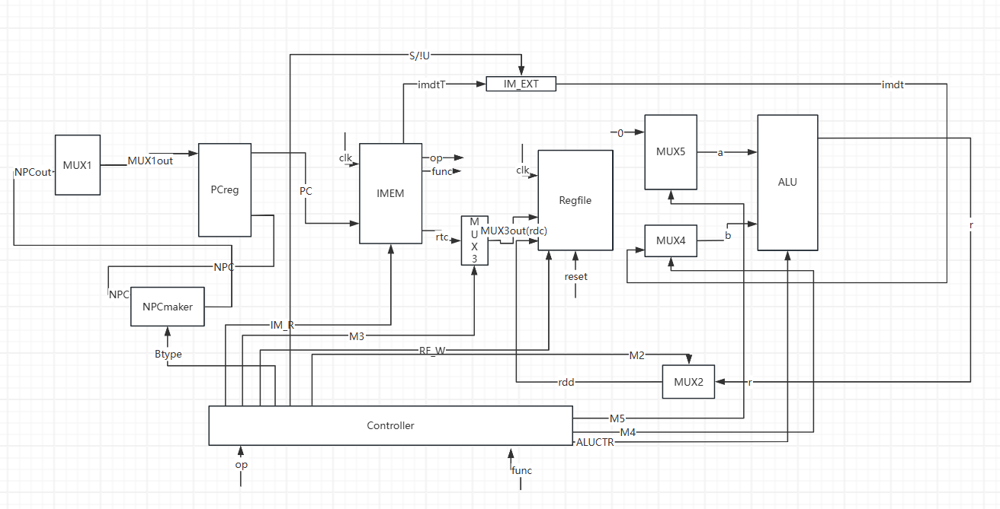  
**图9 lui数据通路**  

在运行lui的过程中，会执行如下动作：  
**时钟的上升沿**：  
- PC->IMEM  
- op->controller  
- func->controller  
- rdc->regfile  
- imdtT->imdt_EXT  
- imdt->ALU  
- $0->ALU(a)  
- ALU执行lui r->regfile(rdd)  

**时钟的下降沿**：NPC-> PCreg  

### j数据通路
j拥有独特的数据通路。  
数据通路如下：  
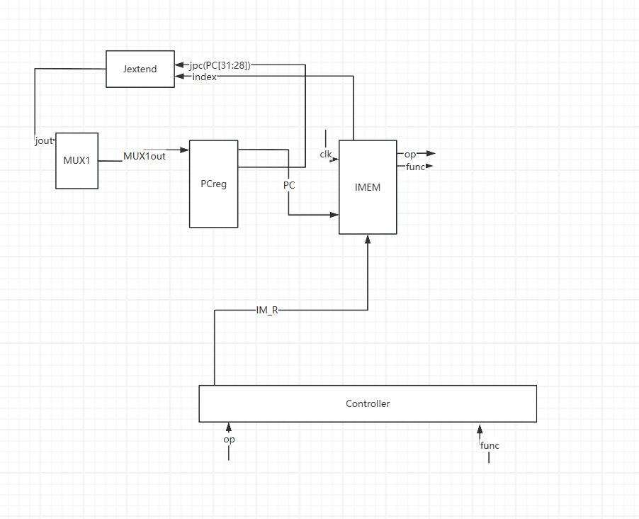  
**图10 j数据通路**  

在运行j的过程中，会执行如下动作：  
**时钟的上升沿**：  
- PC->IMEM  
- op->controller  
- func->controller  
- index->Jextend  

**时钟的下降沿**：jout-> PCreg  

### jal数据通路
jal拥有独特的数据通路。  
数据通路如下：  
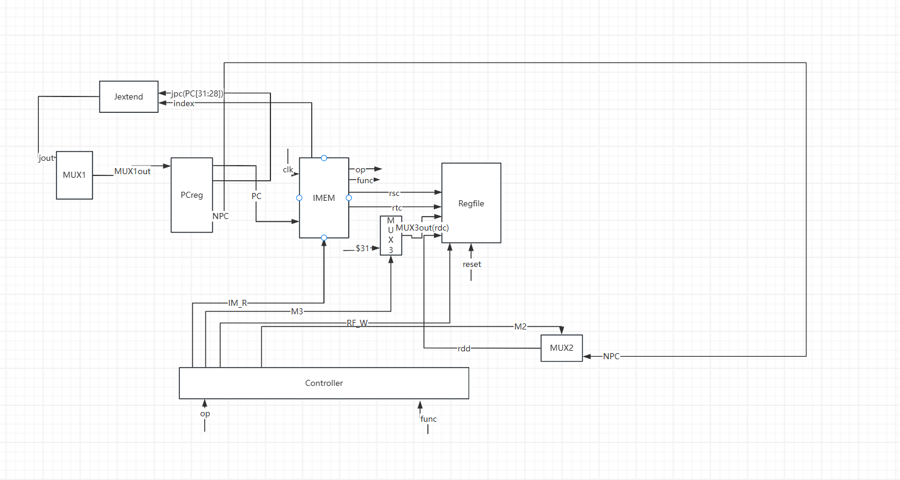  
**图11 jal数据通路**  

在运行jal的过程中，会执行如下动作：  
**时钟的上升沿**：  
- PC->IMEM  
- op->controller  
- func->controller  
- index->Jextend  
- $31 ->regfile(rdc)  
- NPC->regfile(rdd)  

**时钟的下降沿**：jout-> PCreg  

### 整体数据通路
数据通路如下：  
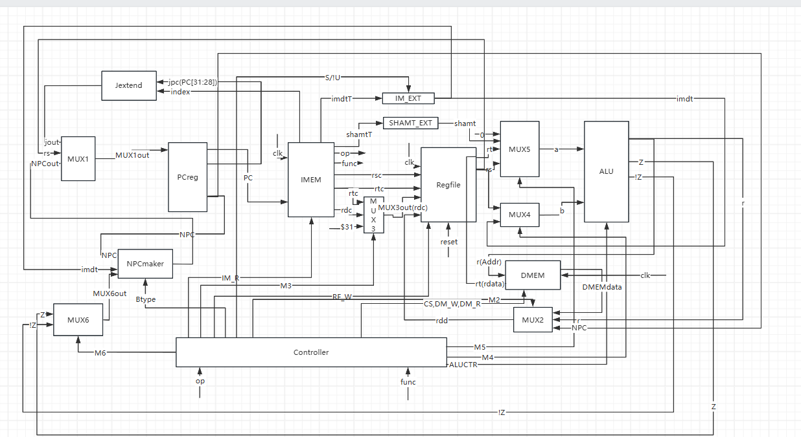  
**图12 整体数据通路**  